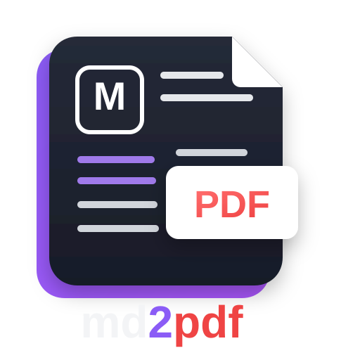

<div align="center">

<p align="center">
  <a href="https://www.npmjs.com/package/@amitdevx/md2pdf"></a>
  <a href="https://www.npmjs.com/package/@amitdevx/md2pdf"></a>
  <a href="https://github.com/amitdevx/md2pdf/blob/main/LICENSE"></a>
</p>
<p align="center">
  <b><a href="https://amitdevx.tech/projects/amitdevx-md2pdf">Project Page</a></b> &nbsp;&middot;&nbsp;
  <b><a href="https://www.npmjs.com/package/@amitdevx/md2pdf">npm</a></b> &nbsp;&middot;&nbsp;
  <b><a href="https://github.com/amitdevx/md2pdf">GitHub</a></b>
</p>
</div>

Convert Markdown to PDF with Mermaid diagrams, KaTeX math, Obsidian syntax, syntax highlighting, batch processing, and Table of Contents generation. Available as a CLI and Node.js API.

## Overview

`md2pdf` is a Markdown-to-PDF rendering engine built on the Unified ecosystem (Remark/Rehype) and Playwright. It generates PDFs with correct pagination, margins, and typography using headless Chromium.

## Features

For detailed release notes, visit the [GitHub Releases](https://github.com/amitdevx/md2pdf/releases) page.

### Core Capabilities
*   **Batch Processing**: Convert multiple files concurrently (`md2pdf *.md`). Uses a persistent Chromium instance for faster processing.
*   **Incremental Cache**: Caches output to speed up batch conversions. Skips unchanged files automatically. Control caching with `--no-cache` and `--clear-cache`.
*   **Plugin API**: Extend functionality using `MarkdownPlugin`, `HtmlPlugin`, `RenderPlugin`, `ThemePlugin`, and `ExportPlugin`. See the [Plugin Documentation](docs/plugins.md).
*   **Theming**: Includes 7 built-in themes (`default`, `github`, `obsidian-light`, `obsidian-dark`, `dracula`, `nord`, `academic`). Use `--theme <name>` to apply.
*   **Obsidian Parity**: Supports native callouts, wiki-links (`[[Link]]`), tags, embeds (`![[Image.png]]`), highlights (`==highlight==`), and YAML frontmatter.
*   **Syntax Highlighting**: Uses Shiki for syntax highlighting across 20+ languages.
*   **Mermaid Diagrams**: Native diagram rendering from code blocks. Safe for concurrent multi-file processing.
*   **Math Rendering**: Supports KaTeX for inline and display LaTeX equations.
*   **Configuration**: Supports persistent configuration files (`md2pdf.config.ts`, `json`, `yaml`) and profiles. See the [Configuration Guide](docs/configuration.md).
*   **Diagnostics**: Use `md2pdf doctor` and `md2pdf init` for environment setup and troubleshooting.

## Installation

```bash
# Install globally
npm install -g @amitdevx/md2pdf
md2pdf init

# Or use locally within a project
npm install @amitdevx/md2pdf
npx md2pdf init
```

> **Note:** Due to npm v12 `allowScripts` defaults, browser binaries are not downloaded automatically during install. You must run `md2pdf init` after installation to fetch the required Chromium dependencies.

## CLI Usage

Generate a PDF from a single Markdown file:
```bash
md2pdf README.md
```

Process multiple files at once using wildcards:
```bash
md2pdf "docs/*.md" --output out_dir/
```

Specify a custom output path and generate a Table of Contents:
```bash
md2pdf input.md --output custom.pdf --toc
```

Convert with custom paper size and margins:
```bash
md2pdf input.md --paper Letter --margin 15mm
```

Force a page break before every H1 heading:
```bash
md2pdf input.md --h1-new-page
```

### Environment Diagnostics & Setup
Initialize a new environment and download dependencies:
```bash
md2pdf init
```

Check system health and pipeline status:
```bash
md2pdf doctor
```

Print advanced internal variables and stack traces if an error occurs:
```bash
md2pdf input.md --debug
```

## Node.js API Usage

Embed the rendering engine in your Node.js applications:

```typescript
import { convert } from '@amitdevx/md2pdf';

const result = await convert({
  input: 'README.md',
  output: 'README.pdf',
  paper: 'A4',
  margin: '20mm',
  toc: true
});
console.log(`Render time: ${result.renderTimeMs}ms`);
```

## Development Setup

```bash
git clone https://github.com/amitdevx/md2pdf.git
cd md2pdf
npm install
npx md2pdf init
```

## Contributing

Please refer to `docs/contributing.md` for our guidelines, branch naming conventions, and coding standards.

## License

MIT License. See `LICENSE` for details.

## Author

**Amit Divekar** | [amitdevx.tech](https://amitdevx.tech) | [Project Page](https://amitdevx.tech/projects/amitdevx-md2pdf) | [GitHub](https://github.com/amitdevx)
