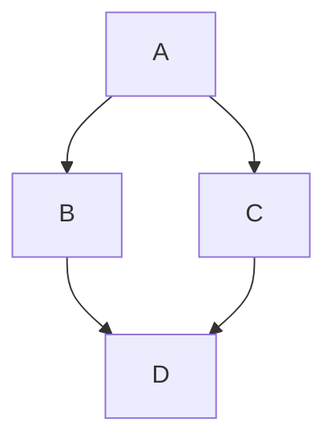

# Mermaid Diagram Support

md2pdf v0.2.1 includes robust, built-in support for rendering [Mermaid](https://mermaid.js.org/) diagrams perfectly inside your PDFs. The rendering is done locally and offline using Playwright, ensuring crisp vector graphics and perfect reproduction of all 12+ diagram types.

## Supported Diagrams

All standard Mermaid diagrams are supported, including:

- **Flowcharts** (`graph`, `flowchart`)
- **Sequence Diagrams** (`sequenceDiagram`)
- **Class Diagrams** (`classDiagram`)
- **State Diagrams** (`stateDiagram-v2`)
- **Entity Relationship Diagrams** (`erDiagram`)
- **User Journey** (`journey`)
- **Gantt Charts** (`gantt`)
- **Pie Charts** (`pie`)
- **Requirement Diagrams** (`requirementDiagram`)
- **Gitgraph Diagrams** (`gitGraph`)
- **Mindmaps** (`mindmap`)
- **Timelines** (`timeline`)
- **XY Charts** (`xychart-beta`)

Just use the standard markdown code block syntax with the `mermaid` language identifier:

```markdown

```

## Theming

Mermaid diagrams are automatically themed based on your active md2pdf theme:

| md2pdf Theme | Mermaid Theme |
|-------------|--------------|
| `default` | `default` |
| `github` | `base` |
| `obsidian-light` | `default` |
| `obsidian-dark` | `dark` |
| `dracula` | `dark` |
| `nord` | `neutral` |
| `academic` | `neutral` |

### Overriding Themes

You can override the theme for all diagrams using the CLI or Frontmatter, or for specific diagrams using the code fence metadata.

**1. Per-diagram override:**
```markdown

```

**2. Global override via Frontmatter:**
```yaml
---
mermaid:
  theme: neutral
---
```

**3. Global override via CLI:**
```bash
md2pdf input.md --mermaid-theme neutral
```

## Sizing and Layout Constraints

By default, Mermaid diagrams automatically scale based on their intrinsic dimensions and will never overflow the page. They are strictly bounded to `100%` of the page width and `100%` of the page height.

You can override these bounding constraints globally:

**Via Frontmatter:**
```yaml
---
mermaid:
  maxWidth: 80%
  maxHeight: 400px
---
```

## Error Handling & Timeouts

If a diagram has invalid syntax, `md2pdf` will **not crash**. Instead, it will gracefully insert a styled error placeholder showing the syntax error and the source code, allowing the rest of the document to render successfully.

If a diagram takes too long to render, it will timeout. The default timeout is 10,000ms (10 seconds).

You can configure this timeout or completely disable Mermaid processing:

**Via Frontmatter:**
```yaml
---
mermaid:
  enabled: false
  timeout: 15000
---
```

**Via CLI:**
```bash
md2pdf input.md --mermaid-timeout 15000
```

## High-Quality Vector Output

Mermaid diagrams are rendered with `deviceScaleFactor: 2` (High-DPI) and injected as raw `<svg>` elements into the final PDF. This means your diagrams will remain perfectly crisp even if the reader zooms in to 400% or prints the document.
