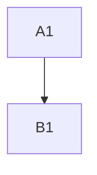
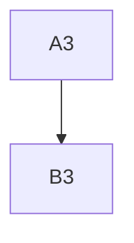
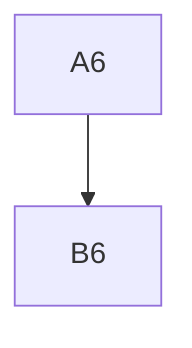
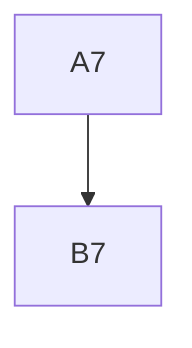
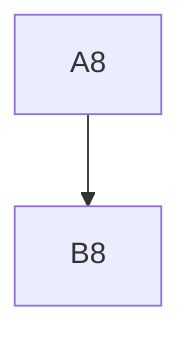
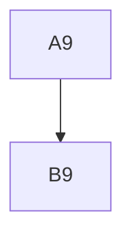
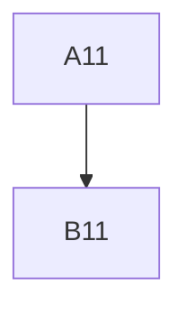
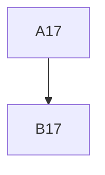
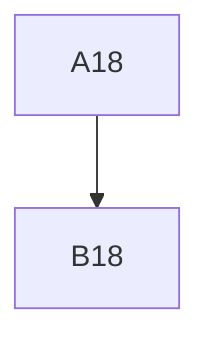
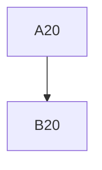

# Mermaid 50 Diagram Benchmark

This file contains 50 simple Mermaid diagrams to test the batch rendering performance of the `renderMermaidBlocks` function via `Promise.all`.


















```mermaid
graph TD; A21-->B21;
```
```mermaid
graph TD; A22-->B22;
```
```mermaid
graph TD; A23-->B23;
```
```mermaid
graph TD; A24-->B24;
```
```mermaid
graph TD; A25-->B25;
```
```mermaid
graph TD; A26-->B26;
```
```mermaid
graph TD; A27-->B27;
```
```mermaid
graph TD; A28-->B28;
```
```mermaid
graph TD; A29-->B29;
```
```mermaid
graph TD; A30-->B30;
```
```mermaid
graph TD; A31-->B31;
```
```mermaid
graph TD; A32-->B32;
```
```mermaid
graph TD; A33-->B33;
```
```mermaid
graph TD; A34-->B34;
```
```mermaid
graph TD; A35-->B35;
```
```mermaid
graph TD; A36-->B36;
```
```mermaid
graph TD; A37-->B37;
```
```mermaid
graph TD; A38-->B38;
```
```mermaid
graph TD; A39-->B39;
```
```mermaid
graph TD; A40-->B40;
```
```mermaid
graph TD; A41-->B41;
```
```mermaid
graph TD; A42-->B42;
```
```mermaid
graph TD; A43-->B43;
```
```mermaid
graph TD; A44-->B44;
```
```mermaid
graph TD; A45-->B45;
```
```mermaid
graph TD; A46-->B46;
```
```mermaid
graph TD; A47-->B47;
```
```mermaid
graph TD; A48-->B48;
```
```mermaid
graph TD; A49-->B49;
```
```mermaid
graph TD; A50-->B50;
```
