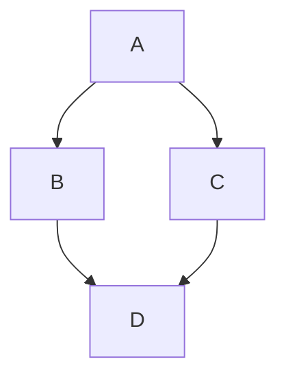

# Theme Preview Document

This document contains various markdown elements to test how themes apply styling to them.

## Typography

Here is a paragraph with **bold text**, *italic text*, and `inline code`.

### Lists

* Item 1
* Item 2
  * Nested item
* Item 3

## Blockquotes

> This is a blockquote.
> It should have a nice border and background color based on the theme.

## Code Blocks

```javascript
function greet(name) {
  console.log(`Hello, ${name}!`);
}
greet('World');
```

## Tables

| Header 1 | Header 2 |
| -------- | -------- |
| Cell 1   | Cell 2   |
| Cell 3   | Cell 4   |

## Math

This is an inline equation: $E=mc^2$

This is a block equation:
$$
x = \frac{-b \pm \sqrt{b^2 - 4ac}}{2a}
$$

## Mermaid Diagrams


